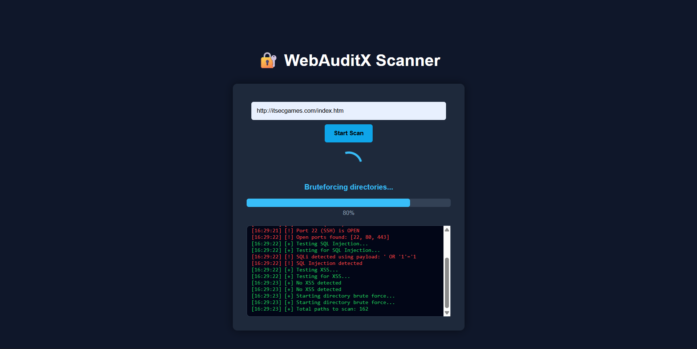
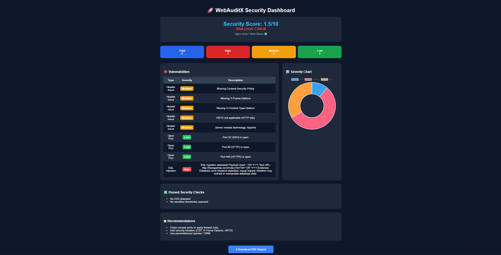

# 🔐 WebAuditX

🚀 **WebAuditX** is an automated web vulnerability scanner built using Python and Flask.  
It detects common security issues and generates professional audit reports with risk scoring.

---

## ✨ Features

- 🔍 SQL Injection Detection
- ⚡ XSS Detection
- 🛡 Security Header Analysis
- 🌐 Open Port Scanning
- 📁 Directory Bruteforcing
- 📊 Risk Scoring Engine (Custom Logic)
- 📄 PDF Report Generation
- 📡 Real-time Scan Progress Dashboard

---

## 🛠 Tech Stack

- Python
- Flask
- ReportLab
- Requests

---

## 📸 Screenshots

### 🔹 Dashboard

### 🔹 Report

---

## 🎥 Demo

Watch WebAuditX in action:
👉 https://www.linkedin.com/posts/mithun-cmd_cybersecurity-websecurity-ethicalhacking-ugcPost-7450768184053272576-m4aB?utm_source=social_share_send&utm_medium=member_desktop_web&rcm=ACoAAFUiNd8BD9T3l1D-FL587dN5cBQEr9Y1w3Y

---

## 📄 Sample Report

A sample PDF report generated by WebAuditX:
👉 [Download Sample Report](sample_report.pdf)

---

## 🎯 Why this project?

WebAuditX demonstrates:
- Practical vulnerability scanning logic
- Real-world attack detection (SQLi, XSS)
- Risk scoring & security analysis
- Full-stack integration (Flask + UI + backend scanning)

---

## 🚀 Getting Started

git clone https://github.com/mithun-cmd/WebAuditX.git

cd WebAuditX

pip install -r requirements.txt

python app.py

---

⚠️ Disclaimer

This tool is intended for educational purposes and authorized security testing only.
Do not use it on systems without permission.

📌 Future Improvements
CVSS-based scoring
Advanced vulnerability detection
Async scanning engine
API support
⭐ Support

If you like this project, consider giving it a ⭐ on GitHub!
